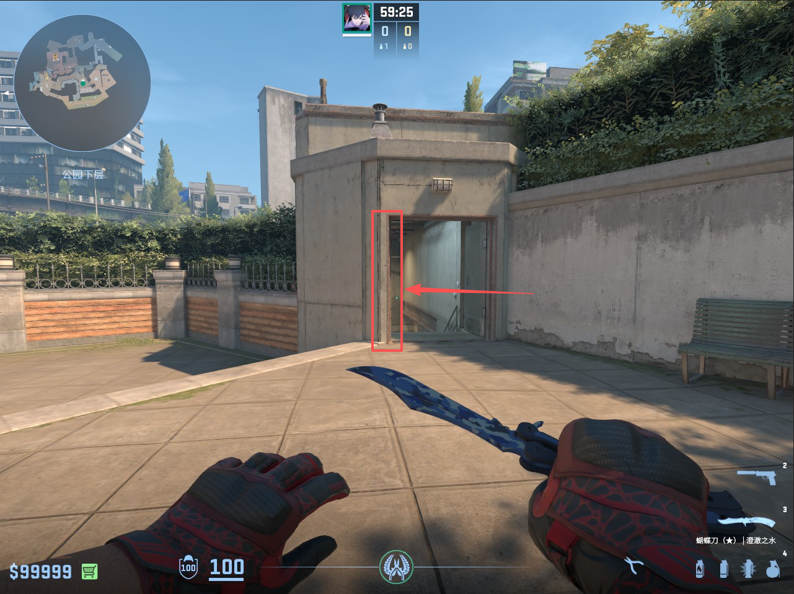
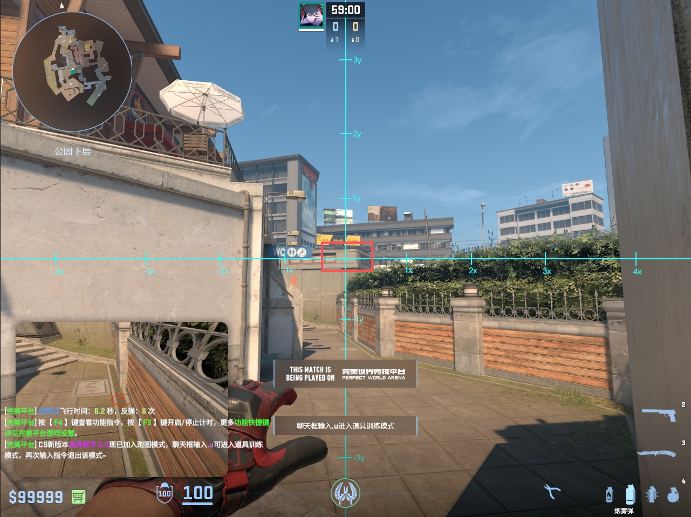
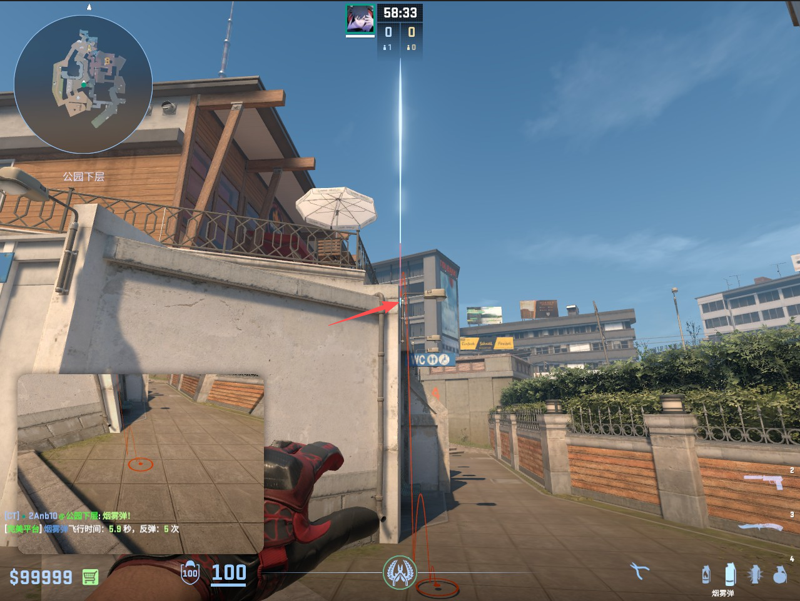
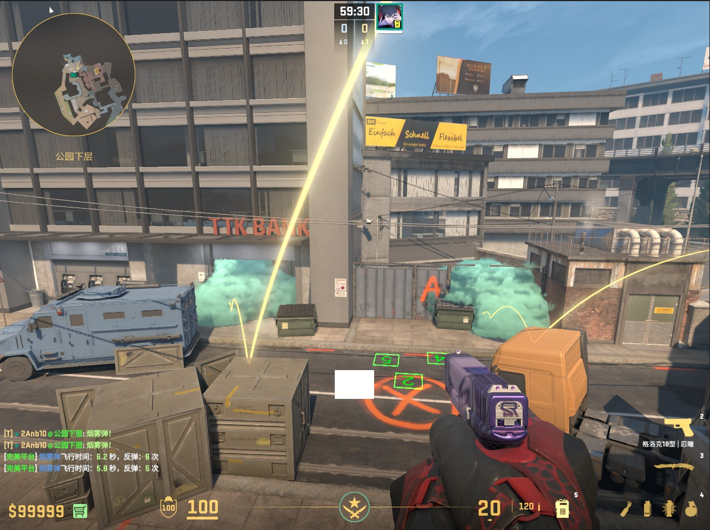
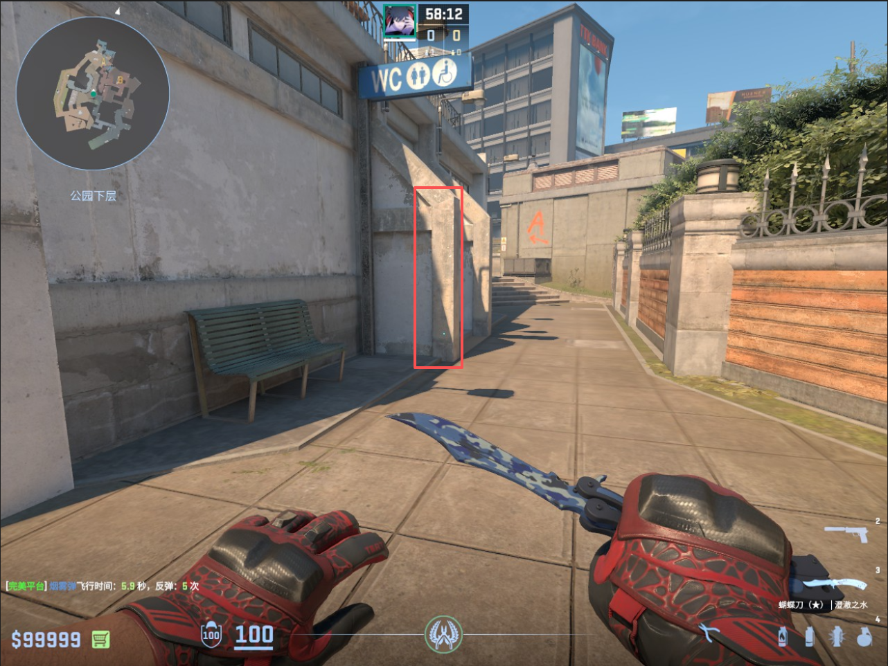
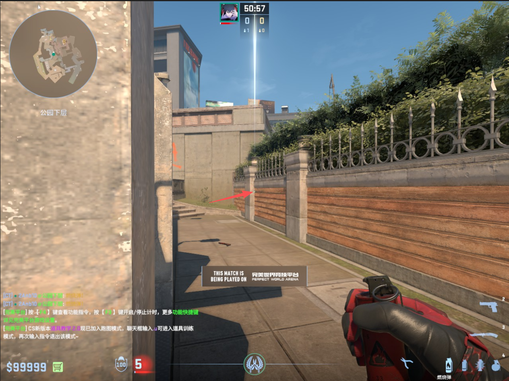
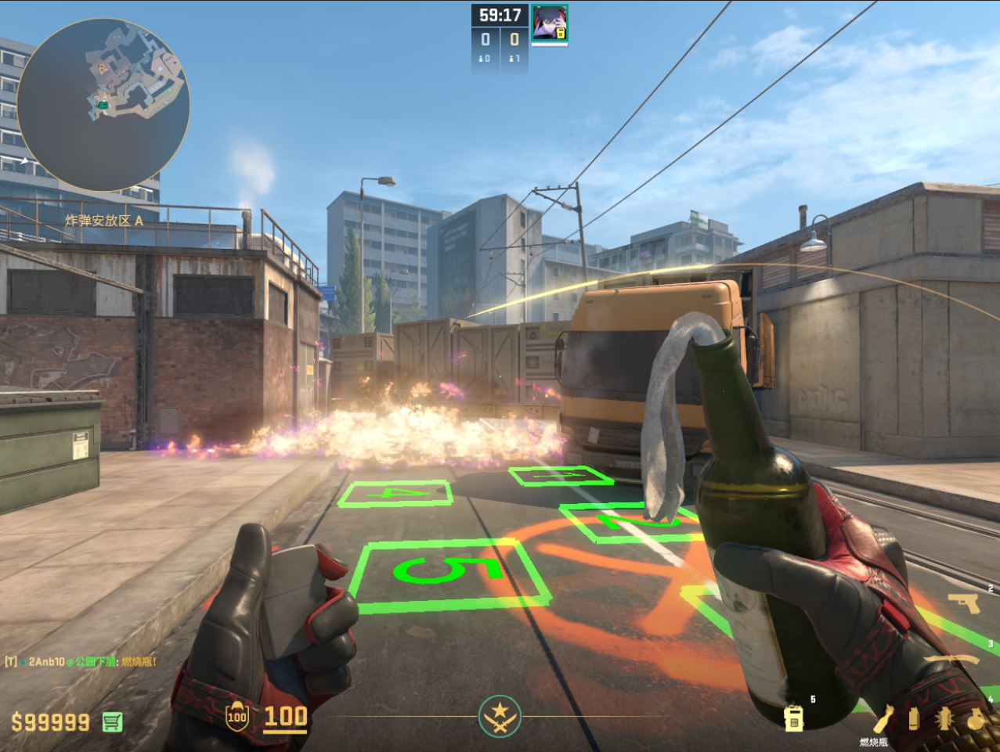
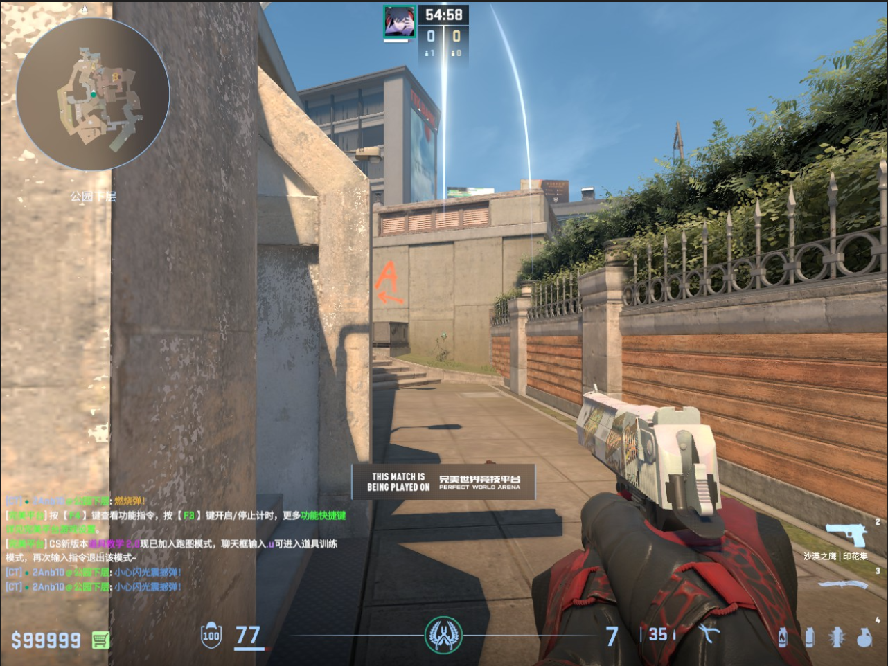

# CT匪口反清套餐

## 匪口烟

瞄准塔吊的钩子，跑到右边长椅的时候**双键跳投**。

**效果图**

## 游乐园火

瞄准深色墙砖与台阶齐平处，经过路灯影子时**左键跳投**

**效果图**

## 匪口闪光

瞄准灯帽顶部，跑着**右键跳投**一颗闪光

**效果图**

闪光轨迹

# A小爆弹

## 下水道口爆银行烟/垃圾桶烟

爆烟位：抵住**门框左侧**

### 垃圾桶烟

瞄准长方形中心偏下，**左键跳投**

**效果图**

### 银行烟

瞄准路灯柱子亮处和墙的缝隙，**左键跳投**

**效果图**

## 车头火

贴住中段墙边。

瞄住第二根木条的顶端，**左键跳投**一颗火

**效果图**

## A包点闪光

瞄准小花的顶端，左键跳投闪光

**效果图**

